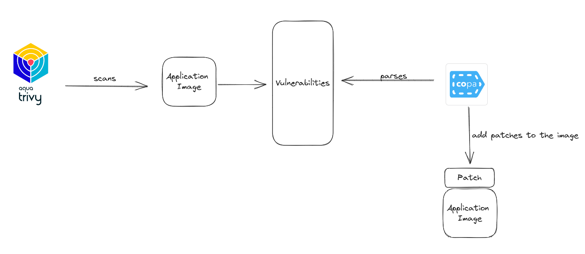
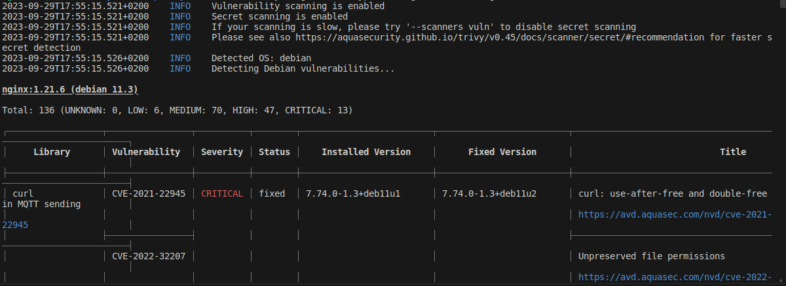
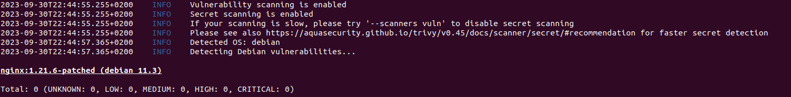

### Why?

- Copa is essential to rapidly patch container images, ensuring security, reducing costs, and simplifying the patching process in a fast-paced operational environment.

### How?



### Installation

1. Install Trivy

- ```wget https://github.com/aquasecurity/trivy/releases/download/v0.45.1/trivy_0.45.1_Linux-64bit.deb```

- ```sudo dpkg -i trivy_0.45.1_Linux-64bit.deb```

2. Install Copa CLI

- ```wget https://github.com/project-copacetic/copacetic/releases/download/v0.4.1/copa_0.4.1_linux_amd64.tar.gz```

- ```tar -xvf copa_0.4.1_linux_amd64.tar.gz```

- ```sudo mv copa /usr/local/bin```

### Test (2*)

- ```docker pull nginx:1.21.6```

- ```trivy image --vuln-type os --ignore-unfixed nginx:1.21.6```

   - 

- ```trivy image --vuln-type os --ignore-unfixed nginx:1.21.6 -f json -o nginx.1.21.6.json```   

- ```docker buildx create --name demo```

- ```copa patch -i  docker.io/library/nginx:1.21.6 -r nginx.1.21.6.json -t 1.21.6-patched --addr buildx://demo```

- ```trivy image --vuln-type os --ignore-unfixed nginx:1.21.6-patched```

  -  


### Resources
1* https://github.com/project-copacetic/copacetic

2* [Copacetic - Patch Your Container Images Seamlessly with COPA](https://www.youtube.com/watch?v=kDkBHV-V_3s)

3* https://github.com/aquasecurity/trivy

4* https://project-copacetic.github.io/copacetic/website/quick-start